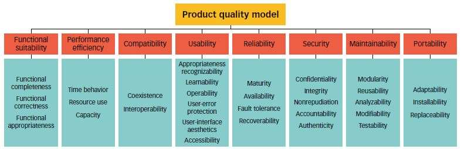

# Definição
A qualidade de software é um conceito que envolve a conformidade de um sistema com os seus respectivos requisitos, bem como a satisfação das necessidades e expectativas de clientes ou usuários.

Existem duas abordagens principais:
## Gerenciamento de defeitos
Um defeito de software pode ser considerado como qualquer falha no atendimento aos requisitos do usuário final. 

Esta abordagem baseia-se em quantificar e gerenciar defeitos, categorizando-os por severidade.

## Atributos de Qualidade
Esta abordagem possui modelos de qualidade fixados que descrevem uma hierarquia de 8 características de qualidade:

# Referência
https://asq.org/quality-resources/software-quality